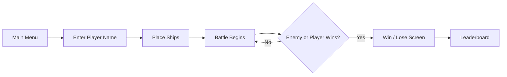

# BattleShipGameplay

<div align="center">
  
  
  
  
</div>

A classic 2D Battleship game built with C++ and SFML, featuring drag-and-drop ship placement, AI-based enemy logic, score tracking, and a polished graphical interface.

## Overview

BattleShipGameplay is a desktop strategy game inspired by the classic Battleship board game. Players set up their fleet, aim at enemy coordinates, and try to sink every enemy ship before they sink yours.

The project includes:

- Tactical ship placement with rotation support
- Human-vs-AI combat flow
- Missile and impact effects
- Sound effects and themed UI
- Leaderboard tracking
- Multiple game states and polished screens

## Game Preview

```text
   ┌────────────────────────────────────────────┐
   │  B A T T L E S H I P   G A M E P L A Y  │
   └────────────────────────────────────────────┘

      A B C D E F G H I J
    1 . . . . . . . . . .
    2 . . . . . . . . . .
    3 . . . . . . . . . .
    4 . . . . . . . . . .
    5 . . . . . . . . . .
    6 . . . . . . . . . .
    7 . . . . . . . . . .
    8 . . . . . . . . . .
    9 . . . . . . . . . .
   10 . . . . . . . . . .

    Your Fleet  ▓▓▓▓▓▓  Enemy Fleet  ▓▓▓▓▓▓
    Missiles Left: 45
```

## Gameplay Flow



## Features

### Strategic gameplay

- Drag-and-drop fleet placement
- Rotate ships before locking them in
- Hidden enemy ship placement
- Limited missile count adds tension and strategy

### AI and combat rules

- Enemy ships are placed automatically
- Missile-based attacks with hit/miss detection
- Visual indicators for ship hits and water splashes
- Score and win/loss conditions

### Visual polish

- Rich SFML-based graphical interface
- Custom fonts and textured sprites
- Animated explosions and splash effects
- Multiple background states and themed game screens

### Game loop and progression

- Menu flow and intro screens
- Leaderboard persistence
- End-of-game result screens
- Player name input and session flow

## Controls

| Action | Control |
|---|---|
| Start game | Mouse click |
| Place ship | Drag and drop |
| Rotate ship | `R` key while dragging |
| Lock placement | Start button |
| Fire at enemy | Click a target tile |
| Navigate menus | Mouse click |
| Exit game | Close window |

## Project Structure

```text
BattleShipGameplay/
├── PArt1.cpp                 # Main game loop and app state management
├── FourthWindow.h            # Game window and transition logic
├── Window_Handling.h         # Screen/window utilities
├── Grid_Handling.h           # Grid logic helpers
├── Ships.h                   # Ship definitions and ship state logic
├── leaderboard.txt          # Saved leaderboard data
├── README.md                # Project documentation
├── FIGHTBACK.ttf            # Main game font
├── simplenote.ttf           # Secondary UI font
├── TeachersStudent-Regular.ttf
├── *.otf / *.ttf            # Additional custom fonts
├── sfml-*.dll               # Runtime dependencies for Windows
├── openal32.dll             # Audio runtime dependency
└── assets/                  # Game art, sounds, backgrounds, and sprites
```

## Tech Stack

| Component | Details |
|---|---|
| Language | C++ |
| Graphics | SFML 2.x |
| Audio | SFML Audio |
| Platform | Windows desktop |
| UI | SFML Text + Sprite rendering |

## How to Run

### Prerequisites

- C++ compiler (MinGW or MSVC)
- SFML 2.x library
- Windows environment

### Build steps

1. Install SFML and configure your IDE or compiler to link the required libraries.
2. Add the project source files to your build.
3. Make sure all `.dll` files are available in the executable folder.
4. Build and run the project.

Example MSVC/MinGW setup:

```bash
g++ -std=c++17 -I"SFML_INCLUDE_PATH" -L"SFML_LIB_PATH" -o battleship PArt1.cpp -lsfml-graphics -lsfml-window -lsfml-system -lsfml-audio
```

If the project is being built in an IDE, ensure that the working directory contains the game assets and runtime DLLs.

## Sound and Art Notes

This project includes custom fonts, background images, missile graphics, explosion effects, and audio cues for immersion. The game was designed with a strong visual identity, giving it a more arcade-like and polished presentation than a basic console battleship clone.

## Winning Conditions

- Sink all enemy ships before the enemy sinks your fleet.
- You have a limited number of missiles, so each shot matters.
- Win the battle to reach the victory screen and update the leaderboard.

## Future Enhancements

Possible improvements include:

- More advanced enemy AI
- Multiplayer support
- More ship types and difficulty levels
- Save system and persistent statistics
- Better responsive scaling for different screen sizes

## License

This project is intended for learning and personal use. If you plan to reuse or distribute it, check whether the original author has specified a license for the code, fonts, and assets.

## Author

Built as a C++ + SFML desktop game project focused on gameplay, visual design, and interactive battle mechanics.

---

<div align="center">
  <sub>BattleShipGameplay • C++ • SFML • Strategy • Arcade</sub>
</div>
